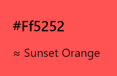

# Hungry Postbox
<i>Connect with people across the globe through handwritten letters</i>

Hungry Postbox is a full-stack application that allows site users to create an account and discover other users who are interested in communicating via handwritten letters. Hungry Postbox is taking social media messaging offline and back to more traditional methods. The website can be viewed on any device while still maintaining its simple, easy to use design.

[View the live project by clicking here](http://hungry-postbox.herokuapp.com/)

## Table of Contents
>1. [User Experience]()
>2. [Testing]()
>3. [Deployment]()
>4. [Credits]()

## User Experience (UX)
___
### Overview

I used user stories and the five planes of user experience design as a framework for planning the project.

### User Stories

*As a site user, I want to*

- Access the website from any device and easily navigate the website regardless of screen size.
- Be able to easily read all content and view all images displayed.
- Create an account with a profile that is customised with my own information and picture.
- Freely edit my profile and if necessary delete my account with ease.
- Contact other members who I would like to become pen pals with and likewise for them to be able to contact me.
- My account password to be securely stored to prevent any unauthorised access to my account.

*As a site owner, I want to*

- Provide a platform for users who to find new pen pals.
- Promote my brand throughout the site, including links to our social media accounts.
- Provide clarity to the user on the purpose of the website.
- Allow users to independently create, edit and delete their accounts without the need to contact the site owner.
- Display visual feedback to the user based on actions they take on the website.

### Strategy

The purpose of the website is to allow users to discover members of the site who are interested in communicating offline through letter writing. The target market of Hungry Postbox is not limited by age but it does focus on people who are either looking from a break from conventional social media or those who could never understand it in the first place.

After reviewing competitor websites, I noted that the main pen pal websites are outdated in design and hide many features behind pay walls. Even with these downsides, they still have new users signing up eevryday and a very active community. My aim with Hungry Postbox is to offer a simple, free to use, modern simplistic design to fill my percieved gap in the market.

The strategy for the project is to implement the needs previously outlined in the user stories and to also meet the business goals.

The first business goal which the website must fulfil is to increase brand awareness of the Hungry Postbox brand. This can be achieved by displaying a large logo on the home page and smaller logos in the navigation and footer of each page. Users will be able to follow our other social media accounts through links in the footer of each page, allowing them to connect with us further if they wish.
The second business goal is to continually grow the userbase through website signups. This can be achieved by strategically placing CTA buttons on the home page to intice new visitors to register an account with us.

### Scope

Features to be included on the website are:
- Photo carousel of user profiles on the home page. This is to give first time visitors a basic insight into some member profiles.
- Sign up form that is split into different sections with a progress bar to give user feedback.
- User profiles that can be edited and deleted.
- Email function which will allow users to communicate with each other in a safe way.
- Members page for signed in users to search for Pen Pals.

Features to be introduced at a later date:
- Filter member search by gender, country, age.
- A built in messaging system.
- Friends list

### Structure

Hungry Postbox is a multi-page website, with certain pages only accessible to users that are logged in.

1. Home

    The Home section contains a large logo, page heading and CTA button for users to register an account. When a user is logged in, the CTA button then directs the user to the members page.

2. About

    The About section contains a simplfied process of how to find a Pen Pal. Below is some imagery and a paragraph about the Hungry Postbox.

3. Discovery

    The Discovery section contains a carousel of 3 random member profiles, heading and CTA button for users to register. This section does not feature on the navigation bar as content here is minimal.

4. Register

    The registration form is styled as an envelope in keeping with the handwritten letter theme. The form contains validation and progress indicators. I included a link to the log in page for users who click register but already have an account.

5. Log In

    The Log In page contains imagery and a simple log in form. It has a link to the registration page for users trying to log in without an account.

6. Profile (Logged In users only)

    User profiles contain all the information they submitted on their registration form, displayed nicely for other members to view. When viewing your own profile, you will see your email address displayed. When viewing other members profiles, this is replaced with a contact button. Below the profile are two buttons to edit or delete the profile. These buttons are only displayed on your own profile.

7. Members (Logged In users only)

    This page is where users can view and search for other member profiles with the goal of finding a pen pal. Member profiles are displayed as cards, which contain an button to view their full profile. Member cards are paginated so each page contains a maximum on 12 member profiles. The search bar allows you to search for members by username.

### Skeleton

I used Balsamiq to create a wireframe for each device. The wireframes were created in the planning stage, so the current version differs slightly.

[Wireframe - Home page](wireframes/home-wireframe.png)

[Wireframe - Register](wireframes/register-wireframe.png)

[Wireframe - Profile](wireframes/profile-wireframe.png)

[Wireframe - Members](wireframes/members-wireframe.png)

### Surface

#### Colour

My main colour theme is a mix of #4db6ac and white. I chose #ff5252 for most of the buttons as it works well with the main colours.

#### Typography

I chose the Raleway font for my text because of its nice design and readability. In keeping with the hand-written letters theme of the website, I also used the handlee font to make certain text appear in a handwritten style. I specified Sans-Serif and Cursive to be used in their place if Google Fonts is unavailable.

## Technologies Used
__

### Languages

- HTML5
- CSS3
- JavaScript
- Python

### Frameworks, Libraries & Programs used

1. Git

    Used for Version control.

2. GitHub

    Project files were pushed from Git to GitHub.

3. Gitpod

    I used Gitpod's dev environment to write the code for my project.

4. Materialize 1.0.0

    Materialize was used mainly for navigation bar, responsive grid layout, pagination, cards and carousel. I also utilised built in classes for applying colour to backgrounds and text.

5. Google Fonts

    Google Fonts was used to access Raleway and Handlee fonts.

6. Font Awesome

    Font Awesome was used to display various icons throughout the site.

7. Adobe Creative Suite

    This was used to create the logo and other imagery on the site.

8. Balsamiq

    Balsamiq was used to create the wireframes.

9. Am I Responsive?

    Used to create the image at the beginning of this readme, with the website displayed on various devices.

10. Heroku

    The live project was deployed to Heroku.

11. MongoDB

    MongoDB was used as the database for this project.

12. Werkzeug

    This was used to protect member passwords.

13. Python’s built-in smtplib library 

    This deserves a shout out for allowing me to send emails to members when another member is interested in contacting them.

14. Hover.css

    Hover.css classes were used to apply custom hover effects to buttons.

## Testing
__

### Validation

The W3C Markup Validator, W3C CSS Validator and jshint were used to validate my code to ensure no syntax errors were overlooked. My Python code was checked to make sure it met PEP8 standards.

## Deployment
__

### Heroku

1. Navigated to [Heroku](https://www.heroku.com/)
2. Signed into my Heroku account. 
3. Selected "New" on the dashboard and then "Create new application" option as below:
4. Selected a name for my application, selected "Europe" as the region and clicked "Create app".
5. With the "Deploy" tab selected, "GitHub - Connect to GitHub" was chosen as the deployment method.
6. Making sure my GitHub profile was displayed, I clicked "connect" next to the GitHub repository for this project.
7. Then I navigated to the "Settings" tab and clicked on "Reveal Convig Vars".
8. Added in my configuration variables to Heroku.
9. Navigated back to the "Deploy" tab and selected "Enable Automatic Deploys" with the master branch selected from the dropdown box.
10. Then clicked on "Deploy Branch" also with master selected.
11. Site is deployed and any changes are automatically deployed each time they are updated and pushed to GitHub during development.

## Credits
__

### Code

- W3Schools

    * [Multi step form](https://www.w3schools.com/howto/howto_js_form_steps.asp)

- Materialize

    * [Carousel](https://materializecss.com/carousel.html)
    * [Card](https://materializecss.com/cards.html#fab)
    * [Pagination](https://materializecss.com/pagination.html)
    * [Navigation bar](https://materializecss.com/navbar.html#center)

- Hover.css

    * [Hover rotate, grow and grow-shadow effects](https://ianlunn.github.io/Hover/)

- Code Pen by asmaa-mohammed

    * [Envelope template which was modified for my own use](https://codepen.io/asmaa-mohammed/pen/bWGKgd)

- Edb83

    * [Code for pagination](https://github.com/Edb83/self-isolution/blob/master/app.py)

- Stack Overflow

    * [Calculating age from DOB, helpful posts](https://stackoverflow.com/questions/22344244/age-calculator-in-python-from-date-mm-dd-yyyy-and-print-age-in-years-only)
    * [Returning a random sample from a MongoDB collection](https://stackoverflow.com/questions/2824157/random-record-from-mongodb)

- Lucid Programming on YouTube

    * [How to send Emails with Python using Gmail](https://www.youtube.com/watch?v=mP_Ln-Z9-XY&ab_channel=LucidProgrammingLucidProgramming)

- Code Institute

    I relied on the Task manager mini project for the fundamentals of this project.

### Acknowledgements

- Tutor support in the Code Institute for their support. Particular shoutout to Jo this time.

- My fellow students on Slack for their inspiration and help.
