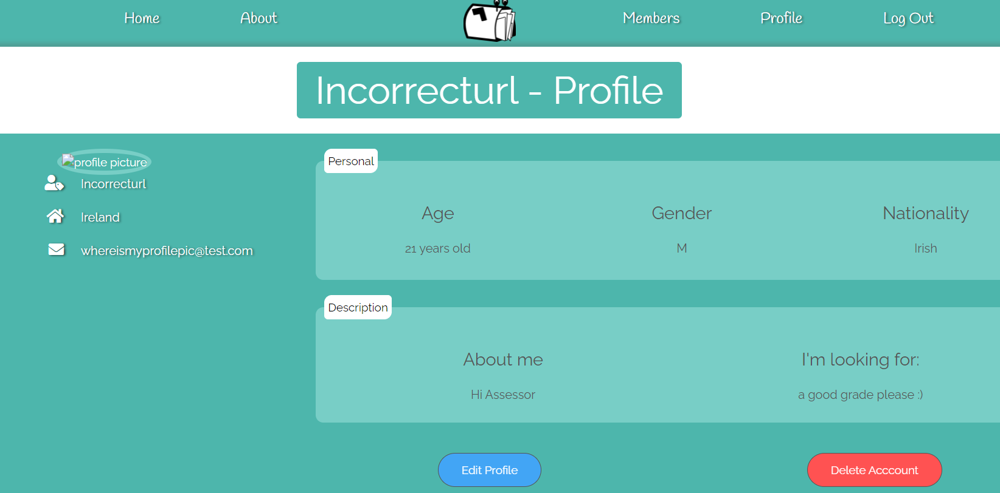
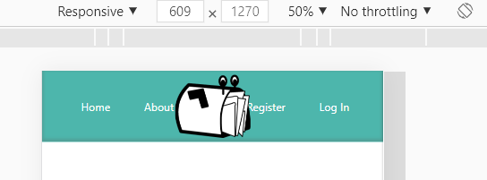
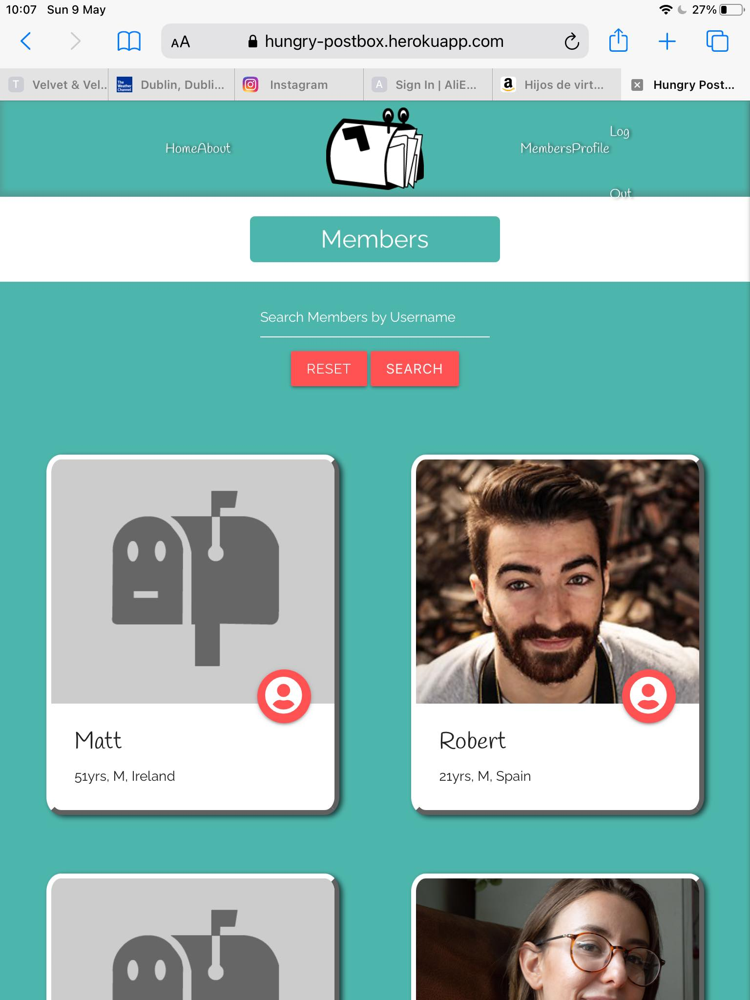

# Hungry Postbox: Testing

## Testing the User Stories
___

### Site User

Access the website from any device and easily navigate the website regardless of screen size.

- The website was created with a mobile first design that scales up to any device size. For example, the collapse navigation bar makes it easier to get around on smaller devices.

Be able to easily read all content and view all images displayed.

- All images and fonts increase / decrease in size based on screen size.
- Buttons increase in size when hovered over.
- Images contain alt tags in the event that they don't display.

Create an account with a profile that is customised with my own information and picture.

- Users are able to register for an account if they provide all the required information.
- Users can personalise their profiles with descriptions about themselves, unique usernames and a profile picture of their choosing.

Freely edit my profile and if necessary delete my account with ease.

- Users can edit their profiles from within their profile page without the need for the site owner to assist.
- Users can edit everything they originally entered into the registration form and this new information will be updated.
- Users can also delete their profiles from their profile page. Defensive programming was used to turn this into a 2 step process so users don't accidently delete their account.

Contact other members who I would like to become pen pals with and likewise for them to be able to contact me.

- When viewing other member profiles, users will be able to click on the clearly visible 'Contact' button. This will send an email to that member, stating that the user is interested in becoming pen pals. The email will contain the user's email address, username and link to their profile.

My account password to be securely stored to prevent any unauthorised access to my account.

-  Werkzeug generate_password_hash is used to securely store user passwords and prevent any unauthorised access.

 

### Site Owner
 

Provide a platform for users who to find new pen pals.

- Users can register, search through member profiles and contact them so I believe this has been achieved.

Promote my brand throughout the site, including links to our social media accounts.

- Each page contains a footer with links to Hungry Postbox Facebook, Twitter and Instagram accounts.
- The navigation bar on each page contains a small Hungry Postbox logo.
- All users are immediately greeted with a large Hungry Postbox logo placed on the Home page.

Provide clarity to the user on the purpose of the website.

- The main title on the home page states the purpose of the website.
- The about us section has a paragraph describing why the website was created and what you need to get started.
- The timeline on the home page gives a simplistic overview of what to expect when engaging in letter writing.

Display visual feedback to the user based on actions they take on the website.

- Hover effects on navigation bar menu items, buttons and footer icons.
- Progress bar at the bottom of the registration form.
- Flash messages for when users create an account, delete an account, enter the wrong login details and successfully / unsuccessfully contact a member.
- Materialize form validation.

## Issues and Bugs during development
___

### Register form not fully loading : Unresolved

Ocassionaly when a new user loads the Register page, the form fields will not fully load for a few seconds as seen in the image below. This issue is still unresolved but occurs infrequently and doesn't impact the functioning of the site.

Click here to display image

 

### No profile pic if user enters incorrect url when choosing their picture : Unresolved
If a user enters an incorrect URL such as hello or "facebook .com" as their profile picture URL then no image will display. Until this can be fixed, the user has the option to edit their profile and try a different URL.

Click here to display image

 

### Navigation bar menu items colliding with the Nav bar logo on smaller devices : Resolved

This was resolved by decreasing the size of the Navigation bar logo and inserting some left / right margin on the menu items to keep them away from the center.

Click here to display image

 

### Date of Birth values displayed on member profiles instead of x years old : Resolved

Initially I calculated years old after the user submitted their DOB on the registration form and pushed that to the database. Then I realised their age would never update as they got older. It also gave trouble with inserted values in the edit profile page as I couldn't reconvert the age to DOB to be pre-filled in the date-picker.
Resolved by creating an age calculator and used jinja to change values from DOB to years old on page load.

### Navigation bar menu items alignment issues on Safari : Resolved

While doing browser testing, I discovered that the nav bar menu items were bunched together and something overlapping the nav bar. I fixed this by targeting the safari browser and applying margin-auto on all menu items.

Click here to display image

 

## Manual Testing

### Home / About

- Click on all nav bar links to confirm they take the user to the correct page.
- Click on both "Register now!" CTA buttons
- Click on Member carousel to test if it spins in both directions.
- Click 3 social media icons in the footer to ensure they link to external sites which open in a new tab.

### Register

- Click "Already a member? Log in." link to ensure it takes users to the login page.
- Hover over envelope to test if the form displays fully.
- Move mouse off form to ensure it remains displayed fully.
- Enter username and password below required number of characters to test validation.
- Try to type more than the maximum number of characters in the username and password field.
- Enter an email with the incorrect format to test validation.
- Click on form next page button with empty fields to test validation.
- Click on next page button, with all fields inputted to test progress bar changes to green tick and next page gets displayed.
- Enter less than required characters in "Country of Residence" and "Nationality" fields to test validation.
- Test maximum characters can be reached in "About you" and "Looking for" text areas.
- Submit without adding custom profile picture to test that default picture is applied.
- Enter custom image url to test custom image is displayed as profile picture.
- Enter incorrect url format to custom image url. <strong>FAIL</strong>
- Enter email address that is already in use while registering to test validation and flash message on click of submit button.

### Login

- Enter incorrect username to test validation and flash message displays.
- Enter correct username but incorrect password to validation and flash message displays.
- Enter correct login details to ensure user is redirected to their profile.
- Click Register link to test that it takes the user to the register page.
- After Login, test the browser back button to ensure the user remains logged in and a flash message displays.

### Profile

- Hover over Edit and Delete buttons to check hover styling is applied.
- Click Edit profile button to test user is brought to edit_profile page.
- Click Delete account to test that modal is displayed.
- Click "Cancel" button in modal to test that modal closes and user account remains unchanged.
- Click "Delete" button to ensure user profile is properly deleted.
- After deleting profile, test the browser back button to ensure user is not still logged in.

### Edit Profile

- Check all fields to make sure they have been automatically populated with the user's information (except password).
- Perform same steps as above registration testing. (Same result)
- Edit each field with a different value and click submit to test all values update on user's profile.
- Click cancel button to ensure user is brought back to profile page and no values have been updated.

### Members

- Hover over search bar buttons and profile buttons on member cards to make sure hover styling is applied.
- Search for a user that doesn't exist to ensure "No members found" text is displayed.
- Click Reset button to ensure member cards are reloaded and search bar is cleared.
- Enter existing username into search bar to ensure expected member card is displayed.
- Click number 2 of pagination links to ensure it displays the second results page.
- Click number 1 of pagination links to ensure it displays the first results page.
- Click the previous/next icons to make sure they work when the option is available to go forward/back pages.
- Click profile button on member cards to check if it brings the user to the member's profile.

### Member Profile

- Click "Contact" button on member profile to ensure modal is presented.
- Click "Cancel" button in modal to test that modal closes and member is not contacted.
- Click "Agree" button to test email delivery and that the user is redirected to the home page with a flash message displayed.

### Log out

- Click "Log out" to ensure user is properly logged out and is redirected to the login page with a flash message displayed.
- Press the back browser button to ensure user is not logged back in.

## Validation
___

The W3C Markup Validator, W3C CSS Validator and JSHint were used to validate my code to ensure no syntax errors were overlooked. My Python code was checked to make sure it met PEP8 standards.

- HTML Validator - PASS
- CSS Validator - PASS
-  JSHint - PASS
- PEP8 online check - PASS

## Lighthouse
___

Google lighthouse was ran on every page of the website. Overall I was happy with the result of nearly every page giving back scores between 90 - 100. The home page, profile and member page had some results dip down to 87 - 90 but I'm still happy with the feedback.

## Browser Testing

Hungry Postbox was checked on the latest versions of Microsoft Edge, Google Chrome, Firefox and Safari. The only issues found where with the navigation bar items on Safari which were misaligned. This was resolved and now the site functions well on all the browsers tested.

## Responsive Testing

I used https://www.responsinator.com/ and the chrome extension Responsive Viewer to test Hungry Postbox on a variety of screen sizes and orientations. All tests were successful, with the site retaining its function and design across the different device simulations.

<a href="#top">Back to top.</a>